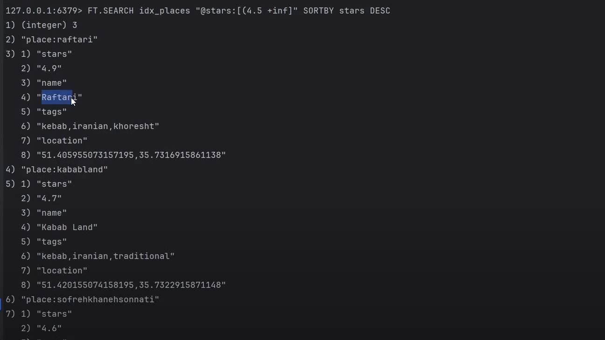
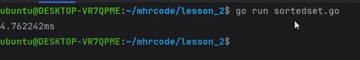

# Redis
usable command and feature of redis in use


### redis is single core
### redis is atomic

```bash
sudo apt install lsb-release curl gpg
Add the repository to the apt index, update it, and then install:

curl -fsSL https://packages.redis.io/gpg | sudo gpg --dearmor -o /usr/share/keyrings/redis-archive-keyring.gpg
```

```docker
docker run -d --name redis-stack-server -p 6379:6379 redis/redis-stack-server:latest
```
```bash
set myName mehrdad
get myName
KEYS *
```
## string, global lock 
wanna have display name for keys
```bash
set user:12:name ali
```
van use string for number because it would support and  do mathematics with it

## Hello World with Node.js and Redis
```bash
var redis = require("redis"); // 1
var client = redis.createClient(); // 2
client.set("my_key", "Hello World using Node.js and Redis"); // 3
client.get("my_key", redis.print); // 4
client.quit(); // 5

$ node hello.js
```

redis is using single thread so no need to consider mutex(prevent concurrent access) and prevent race condition can have automatic expiration(setex, ...) -->This is very useful when database queries take a long time to run and can be cached for a given period of time. Consequently, this avoids running those queries too frequently and can give a performance boost to applications. -->use for global lock and if has value it will reutn the error so two person would not have access to one value and only one can have access
```bash
127.0.0.1:6379> set a 12
OK
127.0.0.1:6379> INCRBY a -1
(integer) 11
```
## The MSET command sets the values of multiple keys at once. --> less syscall and overhead
```bash
127.0.0.1:6379> MSET first "First Key value" second "Second Key value"
OK

127.0.0.1:6379> MGET first second
1) "First Key value"
2) "Second Key value"
```
 ## The TTL (Time To Live) command returns one of the following:
•
 A positive integer: This is the amount of seconds a given key
has left to live
•
 -2: If the key is expired or does not exist
•
 -1: If the key exists but has no expiration time set
```bash
127.0.0.1:6379> EXPIRE current_chapter 10
(integer) 1

127.0.0.1:6379> TTL current_chapter
(integer) 3
```
[] getrange 
[] append
## consider redis is fast but RTT(round trip time) or network is not fast so we should consider it

hash can get a lot of key value but you can not use INCR  so we can use sting and hash with each other to use both feature
hash --> map fields to values within a single key

```bash
HSET page:20 title "hello world" content "<html>...</html>"
HGETALL page:20
HGET page:20
HMGET --> for multi one
```
[] HEXISTS
[] HINCRBYFLOAT mykey field 0.1
[]redis> HSET coin heads obverse tails reverse edge null
    (integer) 3
    redis> HRANDFIELD coin
    "heads"

## set is used for math work
```bash
SADD
SISMEMBER
```
when we use a list of thing and we wanna tag to it
```bash
SADD meat burger kebab
SADD vegt corn salad
SADD iranian kebab gheimeh
```
so we can use intersection and find which ones are in common
```bash
SINTER iranian vegt -->tell which is common in both
SUNION meat iranian  --> put all together
```
tell from root which goes to account as well
```bash
SADD page:/ 3 4 8
SADD page:/account 1 4 10
SINTER page:/ page:/account --> 4 has gone to account as well

SINTERSTORE temp:1  page:/account page:/
SMEMBERS temp:1
```
with sorted set and set can make secondary indexes and have awesome search
[] SSCAN --> iterate

## LIST
store an ordered collection 
use cases:
Implementing message queues or task queues where data needs to be processed in a particular order.
Managing timelines or activity streams, where you need to keep track of actions in a specific order.
Caching recent data like recent log entries, recent activities, etc.
Storing and managing a history of actions or events.
```bash
LPUSH  mlist 1 2 3 4
LRANGE mlist 0 -1
RPUSH  mlist 5
LPOP
RPOP mlist
```
we can use list for fan out, 

```bash
blpop -->block list pop
```

## sorted set
```bash
ZADD scores 1 ali 3.3 mehrdad 2 sara

zrange scores 0 2
1) "ali"
2) "mehrdad"

zrevrange scores 0 2 withscores
zrank scores  mehrdad
 ```
we can give weight to scores
```bash
ZINTERCARD --> give number of intersect
zinter --> consider complexity n^2 or nlogn
```
we wanna know healthy and meat how
```bash
zinterstore tag:meat:healthy 2 tag:healthy tag:meat 
EXPIRE  tag:meat:healthy 120
TTL tag:meat:healthy
BZPOPMAX --> can give higher priority to customer who wants to  better quality and they have paid so no need they wait in normal queue
```

geospatial and golang and POI(point of interest)
https://medium.com/@mhrlife/building-an-online-taxi-app-like-uber-with-golang-part-1-nearby-taxis-c509168ef59f

```bash
o(n) would answer about ten thousands request
o(logn) would answer about one hundered thousands req
```
for finding location of person after ten times of splitting with have only one car in one meter -->  at redis we have geospatial https://redis.io/commands/?group=geo
at google lat and longitude comes vice of versa in contrast with elastic and redis
```bash
GEOADD loc:places 35.70205155011496 51.37873076419946 valiasr --> LONG LATITUDE
GEOSEARCH  --> there is a lot of feature like box, sort, count, coordination --> o(n+log(m))
GEORADIUS  --> GEORADIUS loc:places 35.70205155011467 51.37873076419935 10 km ASC COUNT 10
GEOSEARCH loc:places FROMLONLAT 35.70205155011467 51.37873076419935 BYRADIUS 10 km ASC count 10 --> at website worked //needed new redis version
ZRANGE 
ZCARD
ZINTER --> first we make group smaller then use this one
GEOSEARCHSTORE loc:search:1 loc:places fromlonlat 12.758489 38.788135 byradius 3 km storedist -->DISTANCE CALCULATE FROM PERSON
zrange loc:places:1 0 1
zadd tag:meat 5 valiasr 7 sohrevardi
ZINTERSTORE search:1 2 tag:meat loc:search:1 WEIGHTS 1 0 -->SO WEIGHT OF LOCATION SEARCH IS ZERO
ZREVRANGE search:1 0 -1 WITHSCORES
```
## stream at redis is like kafka, rabbitmq
wht we need it? imagine we have a lot of services and queue and we wanna be sure after after one minute get answer or for performance every 1000 request should be saved bulkly in database
producer --> new post that should be save at database
consumer --> service that read data from it
consumer group --> like fan out
ack and DLQ --> for prevent data loss with error handling and when a req fail again do sth
for stream we need ID --> AUTO GENERATE  first part is timestamp and sequence number
```bash
XADD stream:1 * name ali age 12 --> \\star is wildcard for autogenerating id ,this will happen with producer
XADD stream:1 * name mehrdad age 28
xrange stream:1 - + count 3 --> \\The - and + special IDs mean respectively the minimum ID possible and the maximum ID possible inside a stream this will happened with consumers
xrange stream:1  1711700638030-0 + count 2
xrange stream:1 (1711700638030-0 + count 2 --? we tell that don't consider the id after paranthesis like mathematics
```
how lock consumers from using same data and write nonunique data in database --> consumer groups and spread data and can consider which ones are not ack
```bash
XGROUP CREATE stream:1 group:saveDB $ -->$" symbol is used here as a placeholder to indicate that the consumer group should read from the latest message in the stream.
XREADGROUP -->make new consumer group
@another redis-cli xadd stream:1 * name amir age 18
XREADGROUP GROUP  group:saveDB consumer:1  COUNT 5 STREAMS stream:1 > -->the wild card means gives us new item that has been added recently
XACK stream:1 group:saveDB 1711705471222-0
XREADGROUP  GROUP group:saveDB consumer:1  COUNT 5 STREAMS stream:1 0 --> shows pending ones; those that are not acknowleged yet
```
how to use cache and pending list; after pending goes to that queue pending list and other group does not know that 
```bash
XAUTOCLAIM --> 
eg: XAUTOCLAIM mystream mygroup Alice 3600000 0-0 COUNT 25 -->5 entries that are pending and idle (not having been acknowledged or claimed) for at least an hour, starting at the stream's beginning. The consumer "Alice" from the "mygroup" group acquires ownership of these messages.
xdel --> removes it from queue
```
using redis for fast develop is better choice at first, in contrast with kafka and rabbitmq

## redis instead of elasticsearch
near restaurant and stars of them and food
Redis Stack offers an enhanced Redis experience via the following search and query features:

A rich query language
Incremental indexing on JSON and hash documents
Vector search
Full-text search
Geospatial queries
Aggregations

```bash
HGETALL 
FT.CREATE -->   FT.CREATE idx 
                    ON HASH 
                    PREFIX 1 blog:post: 
                SCHEMA 
                    title TEXT WEIGHT 5.0
                    content TEXT
                    author TAG
                    created_date NUMERIC SORTABLE
                    views NUMERIC

FT.CREATE idx_places ON HASH PREFIX 1 place: SCHEMA name TEXT  tags tag location GEO SORTABLE stars numeric SORTABLE                 
FT.INFO  <INDEX>
```



https://redis.io/docs/interact/search-and-query/basic-constructs/field-and-type-options/


 --> SORTEDSET and location and set and geo spatials
elasticsearch has polygon as well

```bash
FT.SEARCH cities "@coords:[2.34 48.86 1000 km]"
FT.SEARCH books-idx "@title:dogs"
FT.EXPLAIN 
```
## pipeline and lua
when we have diff services and RTT is important
start a tcp request,handshake, idle port binding --> bulk request to redis
```bash
MGET
MSET
HMSET
HMGET
```
pipeline improve RTT and better performance on socket I/O and syscall for read and write


for 1000 request --> 

lua script benefit is atomic and at redis at one server

when needs transaction and logic and need response --> rate limit
[]rate-limit
```bash
```
